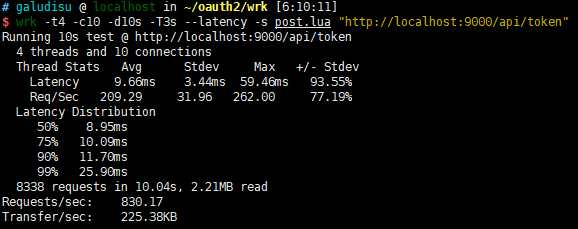

Akka based oauth2 
=================


>## 设计方案
>1. account 和 client 写入到SQL数据库。
>2. code进行sharding，读取后自动消失（重启失效）
>3. token被存储到distributed data中，按需要更新（可以不更新，由于最终一致性问题，导致超时非常严重）
>
>
>题外话：一般情况下，code和token应该使用redis进行缓存存储以保证重启服务依然有效[重构token部分，使用sharding和redis集群处理一致性延迟问题]。

其它语言版本：[English](README.md), [简体中文](README.zh-cn.md)

## 压测wrk





## 创建用户

```
put localhost:9000/api/account
{
	"username": "galudisu",
	"password": "$ea(oo2!f",
	"salt": "ejOpaakl108",
	"email": "galudisu@gmail.com"
}
```

## 申请客户端

1. 申请者Id，必须在account中有记录
2. 申请者Id，需要是开发者角色(此处不验证)
3. 申请者Id，拥有相关权限资格(此处不验证)
4. 申请的网站回调地址

授权服务平台，不作表单验证逻辑

```
put localhost:9000/api/client
{
    "account_id": "b19b28ae-6af5-4603-b588-02be213e2262",
    "redirect_uri": "http://localhost:3000/callback"
}
```

## 申请Code

1. 申请者Id，必须在account中有记录
2. 客户端Id，必须在client中有记录
3. 申请者网站回调地址

```
put localhost:9000/api/code
{
    "account_id": "b19b28ae-6af5-4603-b588-02be213e2262",
    "client_id": "8a70c2923877f4caf6ab45538457c5d628e6bce0"
}
```

## 产生token

1. 由appid和appkey产生，客户端模式，不包含重定向地址

```
post localhost:9000/api/token
{
    "appid": "8a70c2923877f4caf6ab45538457c5d628e6bce0",
    "appkey": "3aa585d12085692348199b5227727bbc2c42a395",
    "grant_type": "client_credentials"
}
```

2. 第三方平台模式，必须包含重定向地址，以及第三方申请的一次性code

```
post localhost:9000/api/token
{
    "appid": "8a70c2923877f4caf6ab45538457c5d628e6bce0",
    "appkey": "3aa585d12085692348199b5227727bbc2c42a395",
    "redirect_uri": "http://baidu.com",
    "code": "9afle",
    "grant_type": "authorization_code"
}
```

3. 账号密码模式，或者叫表单模式

```
post localhost:9000/api/token
{
    "appid": "d9c28170-be68-11e9-b4e3-d3b42412204e",
    "appkey": "d9c28171-be68-11e9-b4e3-d3b42412204e",
    "username": "galudisu",
    "password": "$ea(oo2!f",
    "grant_type": "password"
}
```

4. Refresh token

```
post localhost:9000/api/token
{
    "appid": "d9c28170-be68-11e9-b4e3-d3b42412204e",
    "appkey": "d9c28171-be68-11e9-b4e3-d3b42412204e",
    "refresh_token": "665cad90-be7d-11e9-ae62-d350c56ae498",
    "grant_type": "refresh_token"
}
```

## 统一资源入口

```bash
curl --dump-header -H "Authorization: Bearer ${access_token}" http://localhost:9000/api/resources
```